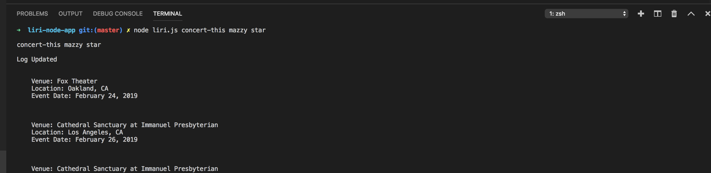
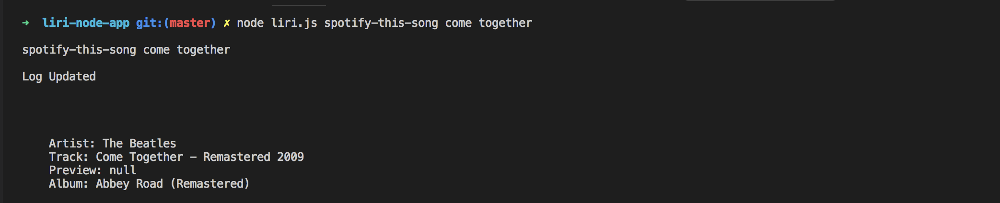
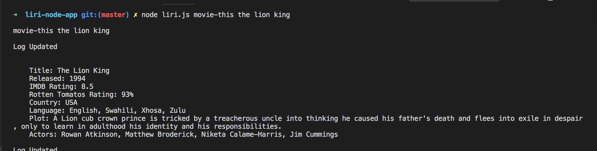
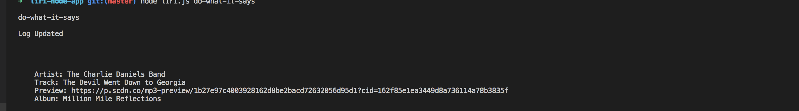

# liri-node-app
Overview:
LIRI is a command line node app that will search Spotify for songs, Bands in Town for concerts, and OMDB for movies. It utilizes axios to retrieve the data. 

To retrieve a listing of upcoming concerts from a specific band/artist enter:

<code>node liri.js concert-this <enter in specific band/artist></code> 

To retrieve song info from your favorite track enter:

<code>node liri.js spotify-this-song <enter song/title></code>

To retrieve movie info from your favorite film enter:

<code>node liri.js movie-this <enter movie name/title></code>

Bonous command below. Enter and see what it does:

<code>node liri.js do-what-it-says</code>

video
https://youtu.be/63FMuEErwFw